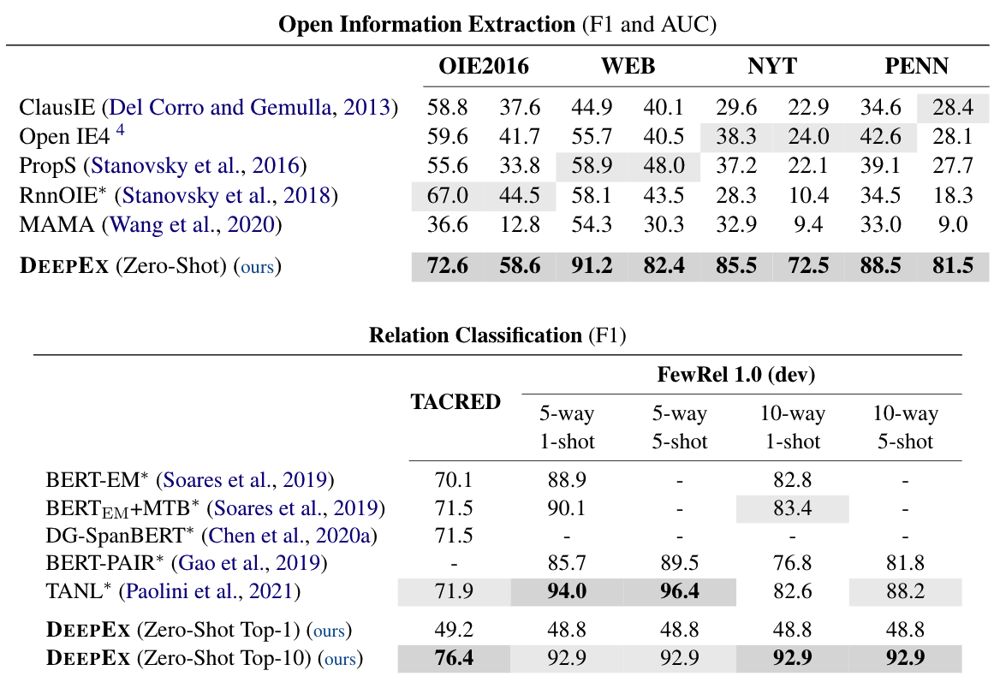

# Zero-Shot Information Extraction as a Unified Text-to-Triple Translation

Source code repo for paper [Zero-Shot Information Extraction as a Unified Text-to-Triple Translation](https://arxiv.org/pdf/2109.11171.pdf), EMNLP 2021.

## Installation

```bash
git clone --recursive git@github.com:cgraywang/deepex.git
cd ./deepex
conda create --name deepex python=3.7 -y
conda activate deepex
pip install -r requirements.txt
pip install -e .
```

Requires PyTorch version 1.5.1 or above with CUDA. PyTorch 1.7.1 with CUDA 10.1 is tested. Please refer to https://pytorch.org/get-started/locally/ for installing PyTorch.

## Dataset Preparation

### Relation Classification

#### FewRel

You can add `--prepare-rc-dataset` argument when running the scripts in [this section](#scripts-for-reproducing-results), which would allow the script to automatically handle the preparation of FewRel dataset.

Or, you could manually download and prepare the FewRel dataset using the following script:

```bash
bash scripts/rc/prep_FewRel.sh
```
The processed data will be stored at `data/FewRel/data.jsonl`.

#### TACRED

TACRED is licensed under LDC, please first download TACRED dataset from [link](https://catalog.ldc.upenn.edu/LDC2018T24). The downloaded file should be named as `tacred_LDC2018T24.tgz`.

**After downloading and correctly naming the tacred `.tgz` data file**, you can add `--prepare-rc-dataset` argument when running the scripts in [this section](#scripts-for-reproducing-results), which would allow the script to automatically handle the preparation of TACRED dataset.

Or, you could manually download and prepare the TACRED dataset using the following script:

```bash
bash scripts/rc/prep_TACRED.sh
```
The processed data will be stored at `data/TACRED/data.jsonl`.

## Scripts for Reproducing Results

This section contains the scripts for running the tasks with default setting (e.g.: using model `bert-large-cased`, using 8 CUDA devices with per-device batch size equal to 4).

To modify the settings, please checkout [this section](#arguments).

### Open Information Extraction
```bash
bash tasks/OIE_2016.sh
```
```bash
bash tasks/PENN.sh
```
```bash
bash tasks/WEB.sh
```
```bash
bash tasks/NYT.sh
```

### Relation Classification
```bash
bash tasks/FewRel.sh
```
```bash
bash tasks/TACRED.sh
```

## Arguments
General script:
```bash
python scripts/manager.py --task=<task_name> <other_args>
```

The default setting is:
```bash
python scripts/manager.py --task=<task_name> --model="bert-large-cased" --beam-size=6
                          --max-distance=2048 --batch-size-per-device=4 --stage=0
                          --cuda=0,1,2,3,4,5,6,7
```

All tasks are already implemented as above `.sh` files in `tasks/`, using the default arguments.

The following are the most important command-line arguments for the `scripts/manager.py` script:
- `--task`: The task to be run, supported tasks are `OIE_2016`, `WEB`, `NYT`, `PENN`, `FewRel` and `TACRED`.
- `--model`: The pre-trained model type to be used for generating attention matrices to perform beam search on, supported models are `bert-base-cased` and `bert-large-cased`.
- `--beam-size`: The beam size during beam search.
- `--batch-size-per-device`: The batch size on a single device.
- `--stage`: Run task starting from an intermediate stage:
    - `--stage=0`: data preparation and beam-search
    - `--stage=1`: post processing
    - `--stage=2`: ranking
    - `--stage=3`: evaluation
- `--prepare-rc-dataset`: If true, automatically run the relation classification dataset preparation scripts. Notice that this argument should be turned on only for relation classification tasks (i.e.: `FewRel` and `TACRED`).
- `--cuda`: Specify CUDA gpu devices.

Run `python scripts/manager.py -h` for the full list.

## Results



**NOTE**

We are able to obtain improved or same results compared to the paper's results. We will release the code and datasets for factual probe soon!

## Related Work

We implement an extended version of the beam search algorithm proposed in [Language Models are Open Knowledge Graphs](https://arxiv.org/pdf/2010.11967.pdf) in [src/deepex/model/kgm.py](https://github.com/cgraywang/deepex/blob/main/src/deepex/model/kgm.py).

## Citation

```bibtex
@inproceedings{wang-etal-2021-deepex,
    title = "Zero-Shot Information Extraction as a Unified Text-to-Triple Translation",
    author = "Chenguang Wang and Xiao Liu and Zui Chen and Haoyun Hong and Jie Tang and Dawn Song",
    booktitle = "Proceedings of the 2021 Conference on Empirical Methods in Natural Language Processing",
    year = "2021",
    publisher = "Association for Computational Linguistics"
}

@article{wang-etal-2020-language,
    title = "Language Models are Open Knowledge Graphs",
    author = "Chenguang Wang and Xiao Liu and Dawn Song",
    journal = "arXiv preprint arXiv:2010.11967",
    year = "2020"
}
```

---

# Additional Scripts (Added for NeoGraphRAG Project)

## Environment Setup for NeoGraphRAG Project

**Important**: Follow these steps to set up DeepEx for the NeoGraphRAG project with proper ranking model support.

### Prerequisites

1. **Create and activate conda environment**:
```bash
conda create --name deepex python=3.7 -y
conda activate deepex
```

2. **Install compatibility dependencies**:
```bash
pip install "cython==0.29.37"
pip install "cymem==2.0.2" "murmurhash==1.0.2" "preshed==3.0.2"
```

3. **Install dependencies**:
```bash
pip install -r requirements.txt --no-build-isolation
pip install -e .
```

4. **Install PyTorch**:
```bash
pip install "torch==1.12.1+cu113" -f https://download.pytorch.org/whl/torch_stable.html
```

5. **Upgrade transformers and tokenizers** (Critical for ranking model compatibility):
```bash
pip install transformers==4.21.3 tokenizers==0.12.1
```

### Ranking Model Setup

6. **Authenticate with Hugging Face Hub**:
```bash
huggingface-cli login --token YOUR_HUGGINGFACE_TOKEN
```
Replace `YOUR_HUGGINGFACE_TOKEN` with your actual Hugging Face token.

7. **Download the ranking model files**:
```bash
# Download all required model files using Python
python -c "
from huggingface_hub import hf_hub_download
import os

print('Downloading DeepEx ranking model files...')
files_to_download = ['config.json', 'vocab.txt', 'tokenizer_config.json', 'pytorch_model.bin']

for filename in files_to_download:
    try:
        file_path = hf_hub_download(repo_id='Magolor/deepex-ranking-model', filename=filename)
        print(f'Downloaded {filename} to: {file_path}')
    except Exception as e:
        print(f'Could not download {filename}: {e}')

print('Model download complete!')
"
```

8. **Apply ranking model fix**:
```bash
cp scripts/bert_contrastive.py scripts/bert_contrastive.py.backup
```

Then modify `scripts/bert_contrastive.py` by replacing the BERT class `__init__` method:
```python
class BERT(nn.Module):
    def __init__(self, model, device='cuda'):
        super(BERT, self).__init__()
        self.device = device
        
        # Handle the deepex-ranking-model case by using local path
        if model == "Magolor/deepex-ranking-model":
            model_path = "/root/.cache/huggingface/hub/models--Magolor--deepex-ranking-model/snapshots/e793d26a74805413796e1e079791f6a22ac226db"
            self.tokenizer = BertTokenizer.from_pretrained(model_path)
            self.model = BertModel.from_pretrained(model_path).to(self.device)
        else:
            self.tokenizer = BertTokenizer.from_pretrained(model)
            self.model = BertModel.from_pretrained(model).to(self.device)
        
        self.criterion = nn.CrossEntropyLoss()
```

### Verification

8. **Test the setup**:
```bash
python process_samples.py 1 results_KELM/result/controlled_extraction/test
```

This should successfully extract triples and save them to `deepex.txt` files.

---

## DeepEx Baseline Testing Script (`process_samples.py`)

**Note**: This script is an additional utility we've added to the original DeepEx repository for the NeoGraphRAG project. 

The `process_samples.py` script provides automated testing of the DeepEx baseline on our dataset. This script:

- Processes a specified number of samples sequentially
- Reads `text.txt` files from sample directories in `results_KELM/result/controlled_extraction/test/`
- Runs DeepEx extraction on each sample using the WEB task
- Converts DeepEx output to the required triplet format: `["SUBJECT", "relation", "OBJECT"]`
- Saves results in `deepex.txt` files within each sample directory

#### Usage

```bash
python process_samples.py <number_of_samples> <test_directory> [k_value]
```

**Parameters:**
- `number_of_samples`: Number of samples to process (required)
- `test_directory`: Path to the test directory containing numbered folders (required)
- `k_value`: Optional K value for top-K extraction (default: 1)

**Examples:**
```bash
# Process 1800 samples with default K=1
python process_samples.py 1800 results_KELM/result/controlled_extraction/test

# Process 1800 samples with K=4
python process_samples.py 1800 results_KELM/result/controlled_extraction/test 4
```

**Top-K Functionality:**
The script now supports adjustable top-K extraction, allowing you to control how many triples are extracted per sentence.

## Aggregation Script (`aggregate_deepex.py`)

This script aggregates the results from multiple `deepex.txt` files into a single output file. It processes numbered folders sequentially and combines their contents.

#### Features:
- Processes numbered folders from 1 to N
- Reads `deepex.txt` from each folder
- Combines results into a single aggregated file

#### Usage

```bash
python aggregate_deepex.py <result_directory> <num_folders>
```

**Parameters:**
- `result_directory`: Path to the directory containing numbered folders (required)
- `num_folders`: Number of folders to process (required)

**Example:**
```bash
# Aggregate results from 1800 folders
python aggregate_deepex.py results_KELM/result/controlled_extraction/test 1800
```

**Output:**
- Creates `aggregated_deepex_triplets.txt` in the `original_prediction` subdirectory
- Each line contains the content of one `deepex.txt` file

## Filtering Script (`filter_common_predictions.py`)

This script filters predictions to keep only samples where all methods (including DeepEx) produced non-empty results.

#### Usage

```bash
python filter_common_predictions.py <base_directory>
```

**Parameters:**
- `base_directory`: Path to the directory containing the `original_prediction` subdirectory (required)

**Example:**
```bash
# Filter predictions from KELM dataset
python filter_common_predictions.py results_KELM/result/controlled_extraction/test
```

**Output:**
- Creates filtered files in `common_predictions_after_deepex` directory

## Empty Predictions Processing Script (`process_empty_predictions.py`)

This script processes prediction text files to replace empty predictions `[]` with `[["", "", ""]]` to be able to compute precision (instead of getting nan) for empty predictions.

#### Usage

```bash
python process_empty_predictions.py <filename> [--postfix POSTFIX]
```

**Parameters:**
- `filename`: Name of the .txt file in the test folder (can include subdirectory path) (required)
- `--postfix`: Optional postfix to add to output filename (default: "_processed")

**Examples:**
```bash
# Process a file with default postfix
python process_empty_predictions.py original_prediction/aggregated_chatgpt_triplets.txt

# Process a file with custom postfix
python process_empty_predictions.py original_prediction/aggregated_deepex_triplets.txt --postfix _fixed
```

**Output:**
- Creates processed files with specified postfix, original files remain untouched

## Computing Metrics

Set the required environment variables:
```bash
export RESULT_DIR="results_KELM/result/controlled_extraction/test/common_predictions_after_deepex"
```

```bash
export PRED_FILE="aggregated_deepex_triplets.txt"
```

```bash
export GOLD_FILE="aggregated_ground_truth_triplets.txt"
```

Then compute the evaluation metrics:
```bash
python ../PiVe/graph_evaluation/metrics/eval.py \
    --pred_file "$RESULT_DIR/$PRED_FILE" \
    --gold_file "$RESULT_DIR/$GOLD_FILE"
```