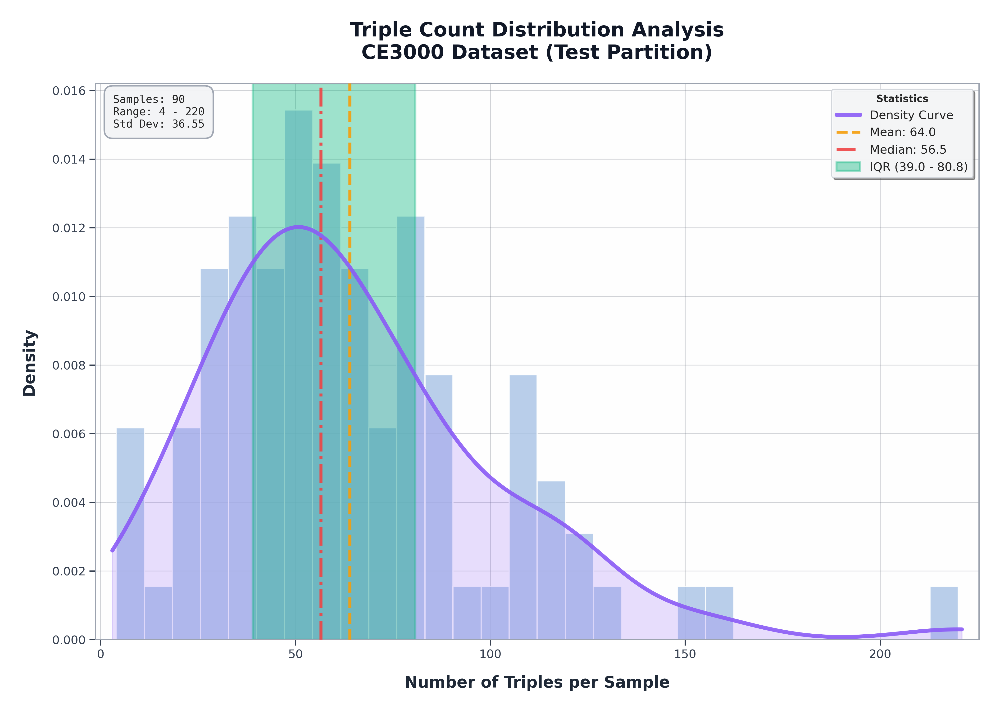
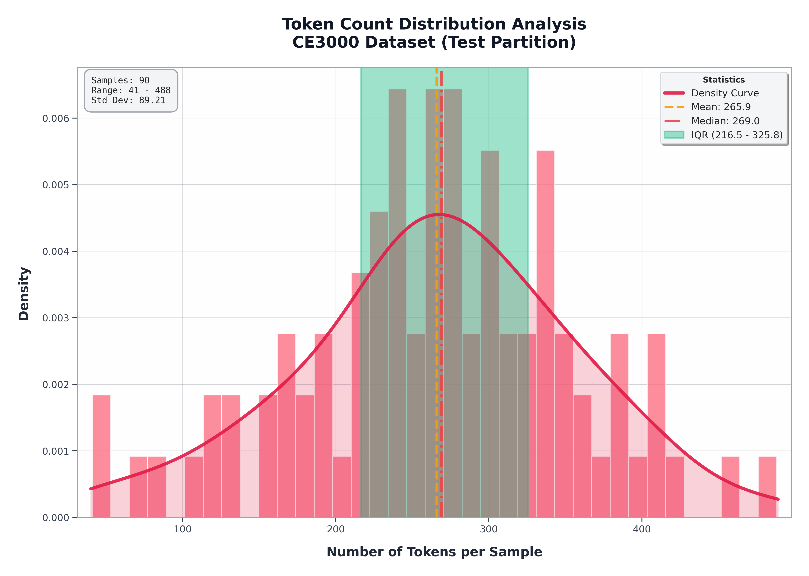
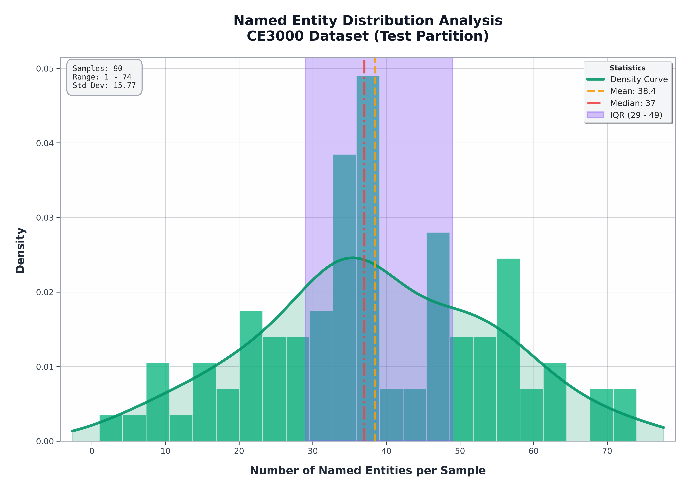
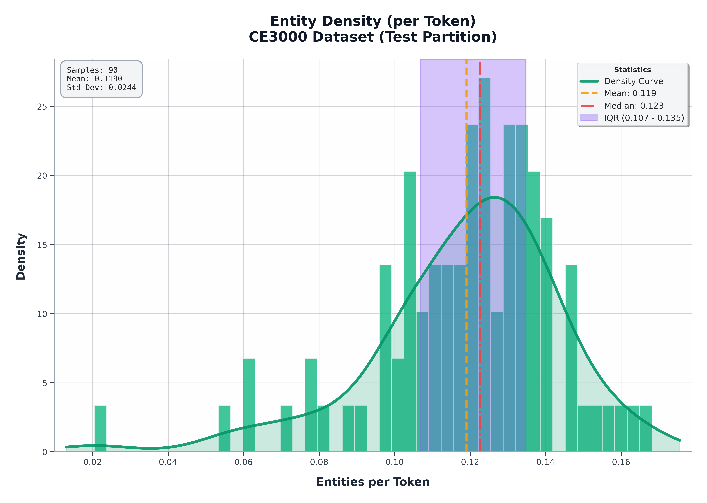
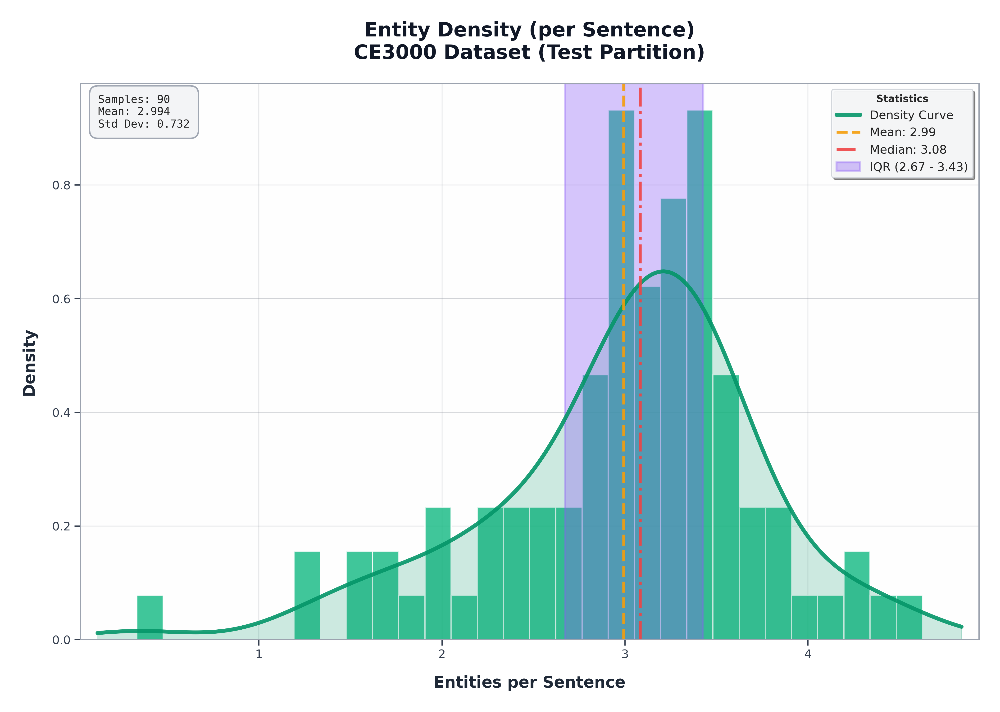
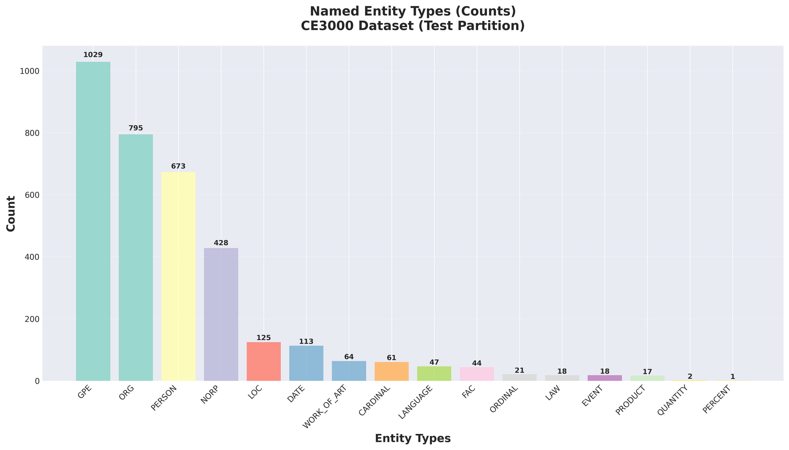
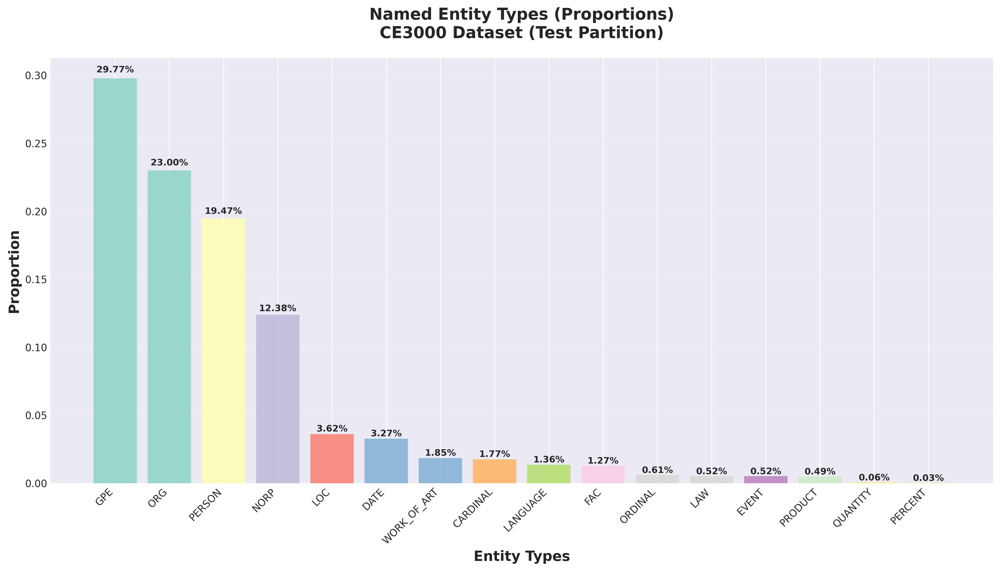

# Dataset Investigation System

A tool for analyzing knowledge graph datasets with statistical visualizations and reports.

## Installation

```bash
pip install -r requirements.txt
```

## Triple Count Distribution Report

To generate a triple count distribution report, run:

```bash
python dataset_analyzer.py --dataset DATASET_NAME --partition PARTITION --report_type triple_count_distribution
```

### Examples:

```bash
python dataset_analyzer.py --dataset CE3000 --partition test --report_type triple_count_distribution
```



## Token Count Distribution Report

To generate a token count distribution report, run:

```bash
python dataset_analyzer.py --dataset DATASET_NAME --partition PARTITION --report_type token_count_distribution
```

### Examples:

```bash
python dataset_analyzer.py --dataset CE3000 --partition test --report_type token_count_distribution
```



## Named Entity Distribution Report

To generate a named entity distribution report, run:

```bash
python dataset_analyzer.py --dataset DATASET_NAME --partition PARTITION --report_type named_entity_distribution
```

### Examples:

```bash
python dataset_analyzer.py --dataset CE3000 --partition test --report_type named_entity_distribution
```

This report generates multiple visualizations:

**Main Distribution:**


**Entity Density Analysis:**



**Entity Type Analysis:**



## Cross-Dataset Evaluation Report

To generate a cross-dataset evaluation report, run:

```bash
python dataset_analyzer.py --report_type cross_dataset_evaluation --train_dataset TRAIN_DATASET --test_dataset TEST_DATASET
```

### Examples:

```bash
python dataset_analyzer.py --report_type cross_dataset_evaluation --train_dataset CE3000 --test_dataset webnlg20
```